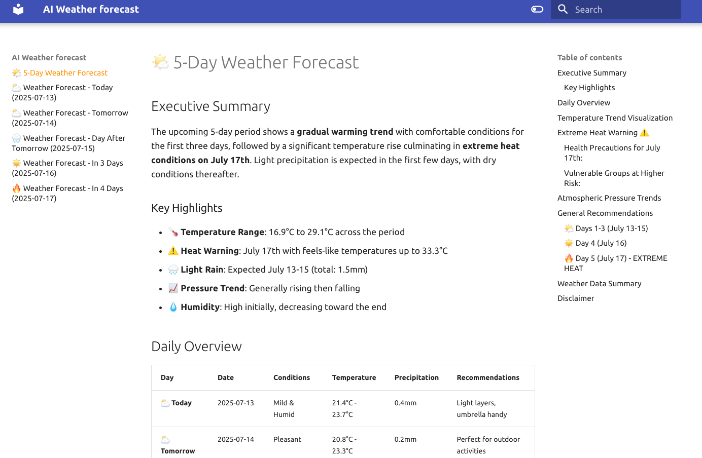
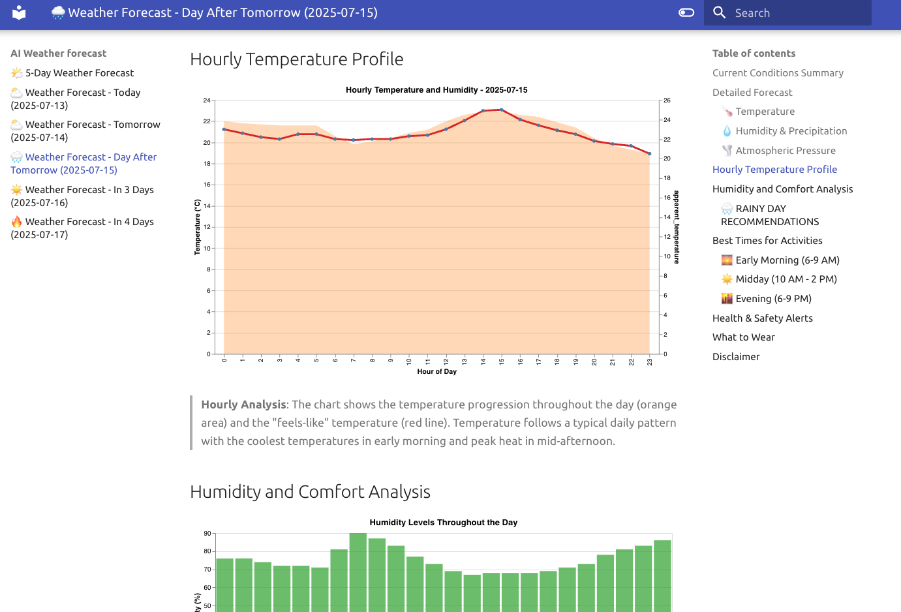

# Building Production-Ready AI Agents with Strands-Agents and Python

Today we're going to build an AI agent that can predict the weather using Strands-Agents framework and Python. This project is designed to show how to integrate external data sources, advanced computational tools, and AI capabilities into a cohesive system. For this experiment we're going to use [Strands-Agents](https://strandsagents.com/) framework, which provides a robust foundation for building intelligent agents that can interact with various tools and APIs. Strands-Agents comes with built-in tools that allow us to create agents that can perform complex tasks by orchestrating multiple tools and APIs. For this project we're going to use the following tools:

- **calculator**: for performing mathematical and financial calculations.
- **think**: for reflecting on data and generating ideas.
- **file_write**: for saving results and analyses to files.
- **python_repl**: for executing Python code and performing advanced analyses.

The last one is particularly useful for overcoming the limitations of large language models (LLMs) when it comes to deterministic calculations. By using a Python REPL, we can ensure that our agent can perform precise computations without relying solely on the LLM's probabilistic outputs. We have Pandas and Scikit-learn for statistical analysis, which allows us to perform advanced data manipulation and machine learning tasks, and the agent will be able to use these libraries to analyze weather data and generate forecasts. Also, I've created a custom tool to fetch hourly weather data from the Open-Meteo API, which provides real-time weather information for specific locations.

```python
import logging
from datetime import datetime, date
from typing import List

import requests
from strands import tool

from modules.weather.models import (
    TemperatureReading, HumidityReading, ApparentTemperatureReading,
    PrecipitationReading, EvapotranspirationReading, SurfacePressureReading, MeteoData)

logger = logging.getLogger(__name__)


class Tools:
    def __init__(self, latitude: float, longitude: float):
        self.latitude = latitude
        self.longitude = longitude

    def get_tools(self) -> List[tool]:
        @tool
        def get_hourly_weather_data(from_date: date, to_date: date) -> MeteoData:
            """
            Get hourly weather data for a specific date range.
            Notes:
                - The response is a MeteoData object containing lists of readings for temperature, humidity,
                  apparent temperature, precipitation, evapotranspiration, and surface pressure.
                - Each reading has a timestamp and a value.

            Returns:
                MeteoData: Object containing weather readings for the specified date range
            """

            start_date = from_date.strftime('%Y-%m-%d')
            end_date = to_date.strftime('%Y-%m-%d')
            url = (f"https://api.open-meteo.com/v1/forecast?"
                   f"latitude={self.latitude}&"
                   f"longitude={self.longitude}&"
                   f"hourly=temperature_2m,relative_humidity_2m,apparent_temperature,precipitation,evapotranspiration,surface_pressure&"
                   f"start_date={start_date}&"
                   f"end_date={end_date}")
            response = requests.get(url)

            meteo = MeteoData(
                temperature=[],
                humidity=[],
                apparent_temperature=[],
                precipitation=[],
                evapotranspiration=[],
                surface_pressure=[]
            )
            data = response.json()

            weather_data_time = data['hourly']['time']

            logger.info(f"[get_hourly_weather_data] Fetched weather data from {start_date} to {end_date}. {len(weather_data_time)} records found.")
            for iso in weather_data_time:
                time = datetime.fromisoformat(iso)
                meteo.temperature.append(TemperatureReading(
                    time=time,
                    value=data['hourly']['temperature_2m'][data['hourly']['time'].index(iso)]))
                meteo.humidity.append(HumidityReading(
                    time=time,
                    value=data['hourly']['relative_humidity_2m'][data['hourly']['time'].index(iso)]))
                meteo.apparent_temperature.append(ApparentTemperatureReading(
                    time=time,
                    value=data['hourly']['apparent_temperature'][data['hourly']['time'].index(iso)]))
                meteo.precipitation.append(PrecipitationReading(
                    time=time,
                    value=data['hourly']['precipitation'][data['hourly']['time'].index(iso)]))
                meteo.evapotranspiration.append(EvapotranspirationReading(
                    time=time,
                    value=data['hourly']['evapotranspiration'][data['hourly']['time'].index(iso)]))
                meteo.surface_pressure.append(SurfacePressureReading(
                    time=time,
                    value=data['hourly']['surface_pressure'][data['hourly']['time'].index(iso)]))
            return meteo

        return [get_hourly_weather_data, ]
```

To allow the LLM to interact with this tool, we define a Pydantic model that describes the expected input and output formats. This ensures that the agent can correctly interpret the data it receives from the API and use it effectively in its analyses.

```python
from datetime import datetime

from pydantic import BaseModel, Field


class TemperatureReading(BaseModel):
    """Temperature reading at 2 meters"""
    time: datetime = Field(..., description="Timestamp")
    value: float = Field(description="Temperature in °C")


class HumidityReading(BaseModel):
    """Relative humidity reading at 2 meters"""
    time: datetime = Field(..., description="Timestamp")
    value: int = Field(..., ge=0, le=100, description="Relative humidity in %")


class ApparentTemperatureReading(BaseModel):
    """Apparent temperature reading"""
    time: datetime = Field(..., description="Timestamp")
    value: float = Field(..., description="Apparent temperature in °C")


class PrecipitationReading(BaseModel):
    """Precipitation reading"""
    time: datetime = Field(..., description="Timestamp")
    value: float = Field(..., ge=0, description="Precipitation in mm")


class EvapotranspirationReading(BaseModel):
    """Evapotranspiration reading"""
    time: datetime = Field(..., description="Timestamp")
    value: float = Field(..., description="Evapotranspiration in mm")


class SurfacePressureReading(BaseModel):
    """Surface pressure reading"""
    time: datetime = Field(..., description="Timestamp")
    value: float = Field(..., gt=0, description="Surface pressure in hPa")


class MeteoData(BaseModel):
    """Model to store meteorological data"""
    temperature: list[TemperatureReading] = Field(..., description="List of temperature readings")
    humidity: list[HumidityReading] = Field(..., description="List of humidity readings")
    apparent_temperature: list[ApparentTemperatureReading] = Field(..., description="List of apparent temperature readings")
    precipitation: list[PrecipitationReading] = Field(..., description="List of precipitation readings")
    evapotranspiration: list[EvapotranspirationReading] = Field(..., description="List of evapotranspiration readings")
    surface_pressure: list[SurfacePressureReading] = Field(..., description="List of surface pressure readings")
```

The use of Strands-Agents is very simple. I've encapsulated the agent logic in a single function that initializes the agent with the necessary tools and prompts. The agent can then be used to generate weather forecasts or answer specific weather-related questions.

```python
_ = ai(
    system_prompt=SYSTEM_PROMPT,
    user_prompt="What will the weather be like tomorrow?")
```

If I run this code, agent will use the provided tools to generate the answer. In the output of the command, you will see the agent's reasoning, the tools it used, and the final answer. First it uses the current time tool to get the current date and time (using `current_time` tool), then it uses the `get_hourly_weather_data` tool to fetch the weather data, after that uses `think` tool to analyze the data, and finally it uses the `python_repl` tool to generate the needed calculations, using Pandas, and produce the final weather forecast. Here's an example of the output you might see when running the agent:

```shell
12/07/2025 15:28:18 [INFO] Check agent weather.
12/07/2025 15:28:18 [INFO] Found credentials in shared credentials file: ~/.aws/credentials
12/07/2025 15:28:18 [INFO] Creating Strands MetricsClient
I'll help you get the weather forecast for tomorrow. First, let me get the current time to determine what "tomorrow" is, and then I'll fetch the weather data for you.
Tool #1: current_time
Now I'll get the hourly weather data for tomorrow (July 13, 2025):
Tool #2: get_hourly_weather_data
12/07/2025 15:28:24 [INFO] [get_hourly_weather_data] Fetched weather data from 2025-07-13 to 2025-07-13. 24 records found.
Let me analyze this weather data to provide you with a comprehensive forecast for tomorrow (July 13, 2025):
Tool #3: think
Let me analyze the weather data directly to provide you with tomorrow's forecast:
Tool #4: python_repl
WEATHER FORECAST FOR TOMORROW (July 13, 2025)
==================================================
Temperature Range: 20.5°C to 23.6°C
Average Temperature: 22.2°C
Feels Like Temperature: Up to 24.6°C

Humidity Range: 70% to 83%
Average Humidity: 77%

Total Precipitation: 1.0mm
Precipitation Timing: Brief shower 4-5 PM

Pressure: Rising from 1012.1 to 1019.9 hPa
Pressure Change: +7.8 hPa (improving conditions)

Tool #5: python_repl

DETAILED HOURLY BREAKDOWN
==============================

🌅 MORNING (6 AM - 12 PM):
Temperature: 20.6°C to 23.0°C
Humidity: 70% to 82%
Conditions: Clear, comfortable temperatures

☀️ AFTERNOON (12 PM - 6 PM):
Temperature: 22.6°C to 23.6°C
Humidity: 71% to 81%
Precipitation: 1.0mm (brief shower 4-5 PM)
Conditions: Warmest part of day, brief afternoon shower

🌙 EVENING (6 PM - 12 AM):
Temperature: 22.0°C to 22.4°C
Humidity: 75% to 82%
Conditions: Pleasant evening temperatures, increasing humidity

📋 SUMMARY & RECOMMENDATIONS:
• Mild and pleasant day with comfortable temperatures
• Brief shower expected between 4-5 PM (carry umbrella)
• Rising atmospheric pressure indicates stable weather
• High humidity in morning and evening - may feel muggy
• Good day for outdoor activities, except during afternoon shower
• Light layers recommended due to temperature variation
## Weather Forecast for Tomorrow (July 13, 2025)

**Overall Conditions:** A pleasant, mild day with mostly clear skies and a brief afternoon shower.

### 🌡️ **Temperature**
- **Range:** 20.5°C to 23.6°C (69°F to 74°F)
- **Feels like:** Up to 24.6°C (76°F)
- **Coolest:** Early morning around 2-6 AM
- **Warmest:** Mid-afternoon around 2 PM

### 🌧️ **Precipitation**
- **Total:** 1.0mm of rain
- **Timing:** Brief shower between 4-5 PM
- **Duration:** Short-lived, about 1 hour
- **Recommendation:** Carry an umbrella for the afternoon

### 💨 **Atmospheric Conditions**
- **Humidity:** 70-83% (higher in morning/evening)
- **Pressure:** Rising from 1012 to 1020 hPa (+7.8 hPa increase)
- **Trend:** Improving and stabilizing weather conditions

### ⏰ **Time-Based Breakdown**

**Morning (6 AM - 12 PM):** Clear and comfortable, 20.6-23°C
**Afternoon (12 PM - 6 PM):** Warmest period with brief shower, 22.6-23.6°C  
**Evening (6 PM - 12 AM):** Pleasant and stable, 22-22.4°C

### 📝 **Recommendations**
- **Clothing:** Light layers, as temperatures vary throughout the day
- **Activities:** Great for outdoor plans, just avoid 4-5 PM for the shower
- **Comfort:** May feel slightly muggy due to higher humidity
- **Overall:** A very pleasant summer day with stable, improving weather conditions

The rising atmospheric pressure indicates this will be a stable weather day with good conditions for most outdoor activities!
Process finished with exit code 0
```

Here you can see the ai function.

```python
import logging

from botocore.config import Config
from strands import Agent
from strands.agent import AgentResult
from strands.models import BedrockModel
from strands_tools import calculator, file_write, current_time, think, python_repl

from core.aws import get_aws_session
from modules.weather.tools import Tools
from settings import (
    IA_MODEL, IA_TEMPERATURE, LLM_READ_TIMEOUT, LLM_CONNECT_TIMEOUT,
    LLM_MAX_ATTEMPTS, MY_LATITUDE, MY_LONGITUDE, )

logger = logging.getLogger(__name__)


def get_agent(
        system_prompt: str,
        read_timeout: int = LLM_READ_TIMEOUT,
        connect_timeout: int = LLM_CONNECT_TIMEOUT,
        max_attempts: int = LLM_MAX_ATTEMPTS) -> Agent:
    config = Config(
        read_timeout=read_timeout,
        connect_timeout=connect_timeout,
        retries={'max_attempts': max_attempts}
    )
    session = get_aws_session()

    base_tools = [calculator, think, python_repl, file_write, current_time]
    custom_tools = Tools(latitude=MY_LATITUDE, longitude=MY_LONGITUDE).get_tools()
    all_tools = base_tools + custom_tools

    bedrock_model = BedrockModel(
        model_id=IA_MODEL,
        temperature=IA_TEMPERATURE,
        boto_session=session,
        boto_client_config=config,
    )
    return Agent(
        model=bedrock_model,
        tools=all_tools,
        system_prompt=system_prompt
    )


def ai(
        system_prompt: str,
        user_prompt: str,
        read_timeout: int = 300,
        connect_timeout: int = 60,
        max_attempts: int = 5) -> AgentResult:
    agent = get_agent(
        system_prompt=system_prompt,
        read_timeout=read_timeout,
        connect_timeout=connect_timeout,
        max_attempts=max_attempts)

    return agent(user_prompt)
```

As you can see, the agent is only a few lines of code. The magic is in the prompts and the tools that it uses. The agent can be used to generate weather forecasts, analyze historical weather data, and provide practical recommendations based on the weather conditions. This is the main prompt:

```yaml
FORECAST_PROMPT = f"""
## Instructions for the weather forecast
Your mission is to analyze weather data and provide accurate and useful forecasts for the next {{days}} days.
You have access to a tool called `get_hourly_weather_data` that allows you to obtain hourly weather data.
As a meteorology expert, you must thoroughly analyze the data and provide accurate and useful forecasts.

Take into account possible extreme heat days, especially in summer.
Remember that extreme heat is considered when maximum and minimum temperatures exceed local temperature thresholds for several consecutive days,
often during a heatwave. These temperatures, along with humidity, can be harmful to health, especially for vulnerable groups.

## Report style
All reports must be written in English.
The report must be clear, concise, and easy to understand.
It should include:
- A summary of current weather conditions.
- A detailed forecast for the coming days, including temperature, precipitation, wind, and any other relevant data.
- Practical recommendations based on the forecast, such as precautions to take or recommended activities.
- Be creative and innovative in your approach, using advanced data visualization techniques to enhance the report.

## Data visualization
The report, in markdown, must be visually appealing and innovative.
You will use tables, lists, and other formatting elements to enhance readability.

### Graph format
- Generate the graph configuration in JSON format, compatible with the Vegalite library.
- Ensure the JSON is valid and compatible with the Vegalite library.
- The graphs must be innovative, leveraging the library's potential. Do not limit yourself to simple bar or line charts. Aim for a wow effect.

- Required JSON structure:
    * title: main title of the graph, at the top of the graph. The title must be brief and descriptive.
    * the title must be in the layout.title.text directive
    * layout.showlegend will be true/false, to show the graph legend. Some graphs do not need a legend, such as simple line charts.
- After each graph, generate a blockquote briefly explaining what the graph shows and its context.

...
```

For the visualization I'm using [MkDocs](https://squidfunk.github.io/mkdocs-material/) , a simple static site generator for Markdown files. To have more advanced visualizations, I'm using the Vega-Lite library, which allows you to create interactive and visually appealing charts. The agent generates the JSON configuration for the graphs in a format compatible with Vega-Lite, which can then be rendered in the Markdown reports. 




For AI, I'm using Claude 4 Sonnet, provided by Amazon Bedrock. For the experiment it's enough, but if you create a cron job to run the agent every day, you'll have your 5-day forecasting system ready to go. The project tries to show how to use AI agents to solve real-world problems, and how to integrate them with external data sources and tools. The agent can be extended to include more advanced features, such as integrating with other APIs or using more complex machine learning models for weather prediction.

## Extra

First I've done the example building a tool to fetch weather data, but we also can use a MCP, the standard protocol to integrate tools in AI agents. 
I've created a MCP server using FastMCP

```python
from datetime import date

from fastmcp import FastMCP
from modules.weather.tools import get_hourly_weather_data_tool
from modules.weather.models import MeteoData
from settings import MY_LATITUDE, MY_LONGITUDE

mcp = FastMCP("FastMCP Weather Agent", version="1.0.0")


@mcp.tool(description="Get hourly weather data for a given date range.")
def get_hourly_weather_data(from_date: date, to_date: date) -> MeteoData:
    return get_hourly_weather_data_tool(
        latitude=MY_LATITUDE,
        longitude=MY_LONGITUDE,
        from_date=from_date,
        to_date=to_date)

if __name__ == "__main__":
    mcp.run(transport="streamable-http", host="127.0.0.1", port=8888, path="/mcp")
```

And I've created a new client to interact with the MCP server:

```python
def ai_mcp(
        system_prompt: str,
        user_prompt: str,
        read_timeout: int = 300,
        connect_timeout: int = 60,
        max_attempts: int = 5) -> AgentResult:

    def create_streamable_http_transport():
        return streamablehttp_client("http://localhost:8888/mcp/")

    streamable_http_mcp_client = MCPClient(create_streamable_http_transport)

    with streamable_http_mcp_client:
        base_tools = [calculator, think, python_repl, file_write, current_time]
        mcp_tools = streamable_http_mcp_client.list_tools_sync()
        logger.info(f"Available MCP tools: {[tool.tool_name for tool in mcp_tools]}")
        all_tools = base_tools + mcp_tools

        bedrock_model = get_bedrock_model(
            read_timeout=read_timeout,
            connect_timeout=connect_timeout,
            max_attempts=max_attempts
        )

        agent = Agent(
            model=bedrock_model,
            tools=all_tools,
            system_prompt=system_prompt
        )
        return agent(user_prompt)
```
